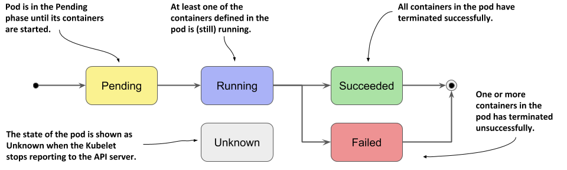

# Pod
## what is the pod ?
- the smallest unit at K8s
- pod = group of containers + storage resourcing + network confj. + rules for running containers
- any pod when create it take IP address

## Pod lifecycle
- etcd has entity ro store pod status
- if pod status change , kubelet send to Api server the new status and change it at etcd



1- **pending**
- when Api server validate the request and store it at etcd 
- no containers created at this phase.

2- **Running**
- all container execuate without any errors
- each container dont restart again .

3- **Failed**
- some containers when execuate return code error.

4- **Unknown**
- kubelete cant know the error status or when missconnection between master and node

## How can create Pod?


1- **imparative**
- Through command or API calls
as:
`kubectl run my-pod --image=nginx`

2- **Declarative**  
- creating manifest files (@K8s we can use JSON or YAML format)
- perfer use this way (to know what the desired state from mainfest file any time if you forget)

### using YAMAL
#### main field must file have 

- `apiVersion` and `kind` define the type of Kubernetes resource.
*note*: we can get it from run this command `kubectl api-resources`.
- -`metadata` contains information about the Pod, such as its name,labels,....
- -`spec` defines the **desired state** of the Pod and containers specs we need.

simple example 

```yaml
  apiVersion: v1 
  kind: Pod 
  metadata: 
    name: my-pod-2 
    labels: 
      app: nginx 
      environment: development 
  spec:
    containers: 
      - name: nginx-container 
        image: nginx 
        ports: 
          - containerPort: 80 
      - name: sidecar-container 
        image: busybox 
        args: ["sleep", "3600"] 
  ```
## Basic commmands 
- Create a Pod: `kubectl apply -f <pod.yaml>`  
- List all Pods: `kubectl get pods`
- List Pods with details: `kubectl get pods -o wide`
- Describe a Pod: `kubectl describe pod <pod-name>`
- View Pod logs: `kubectl logs <pod-name>`  
- View logs for a specific container: `kubectl logs <pod-name> -c <container-name>`  
- Stream live Pod logs: `kubectl logs -f <pod-name>`
- Execute a command in a Pod: `kubectl exec -it <pod-name> -- /bin/bash`
- Execute a command in a specific container: `kubectl exec -it <pod-name> -c <container-name> -- /bin/bash`  
- Delete a Pod: `kubectl delete pod <pod-name>`  
# Multi-Container Pods
- at prod best practise pod has only one container
- k8s allow pod has more container (app conatainer called **main/primary** container and anther called **helper** containers)
- all containers share *[networking(namespace) , storage(volumes)]*
- pod has only one IP we can access any container with spacific **Port**
- helper conatainer make the main container to foucs on its taks
## Types
1-**Init Container**
- can be one or more (Run sequentially, one after the other)
- it run firstly if it success the main container will run , if any  failed main container cant run(never start)
- it run only one time when start pod (cant make it restart at any cond )
- execute specific task then die and  main container starts 
- may be there is more than one init container each one execute task and die before main container starts 
**used cases**
1- verify DB connection before start app.
2- check if external API is reachable or not.
3- create file or dirc or procces any thing at file system (copy ,clone,delete....).
4- check if external srvc is avaliable or not.


